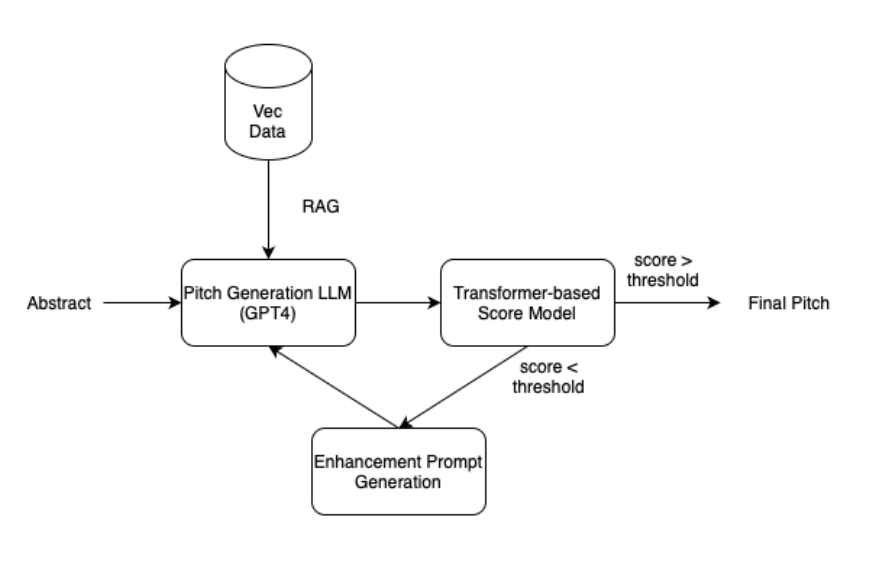
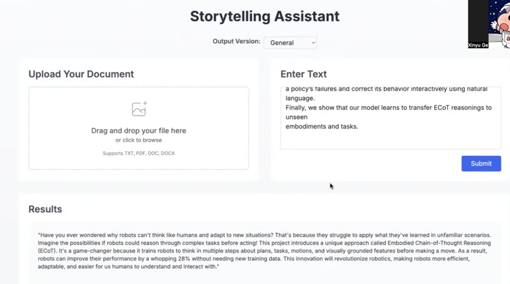

# Storytelling Assistant

A powerful AI-powered tool that helps transform technical content into engaging narratives for different audiences. The system uses a combination of RAG (Retrieval-Augmented Generation) and a custom scoring model to generate and evaluate high-quality pitches.



## Features

- **Multiple Output Modes**:
  - Investor Mode: Tailored for pitching to investors
  - Conference Mode: Optimized for academic conference submissions
  - General Mode: Accessible to broad technical audiences

- **Quality Assessment**:
  - Custom ML-based scoring model evaluates pitches on four criteria:
    - Coherence (1-5 scale)
    - Consistency (1-5 scale)
    - Fluency (1-5 scale)
    - Relevance (1-5 scale)
  - Total score ranges from 4-20, with higher scores indicating better quality

- **Self-Reflection System**:
  - Automatically improves generated content based on scoring feedback
  - Multiple generation attempts to achieve quality threshold
  - Maintains best version across attempts


## Installation

1. Clone the repository:
```bash
git clone [repository-url]
cd Storytelling-Assistant
```

2. Install dependencies:
```bash
pip install -r requirements.txt
```

3. Set up environment variables:
Create a `.env` file in the root directory with your OpenAI API key:
```
OPENAI_API_KEY=your_api_key_here
```

4. For inference, see `text.py` script. 
## Usage


### Scoring Model

The scoring model evaluates pitches on a 1-5 scale for each criterion:
- Coherence: How well the pitch flows and maintains logical structure
- Consistency: How well the pitch aligns with the original abstract
- Fluency: How well-written and natural the pitch is
- Relevance: How relevant the pitch is to the original content

Total scores range from 4-20, with higher scores indicating better quality.

You can download the model checkpoint from: https://drive.google.com/file/d/1-9Z_tGJpaVj0ujvArN3hm2krzu9cIxq8/view?usp=share_link
## Project Structure

```
Storytelling-Assistant/
├── ragcot.py                 # Main RAG system implementation
├── scoring_model_inference.py # ML-based scoring model
├── scoring_model.pt          # Trained scoring model weights
├── requirements.txt          # Project dependencies
├── datas/                    # Vector database and documents
└── evaluation/              # Evaluation scripts and benchmarks
```

## Dependencies

- Python 3.7+
- OpenAI API
- PyTorch
- Transformers
- NumPy
- scikit-learn
